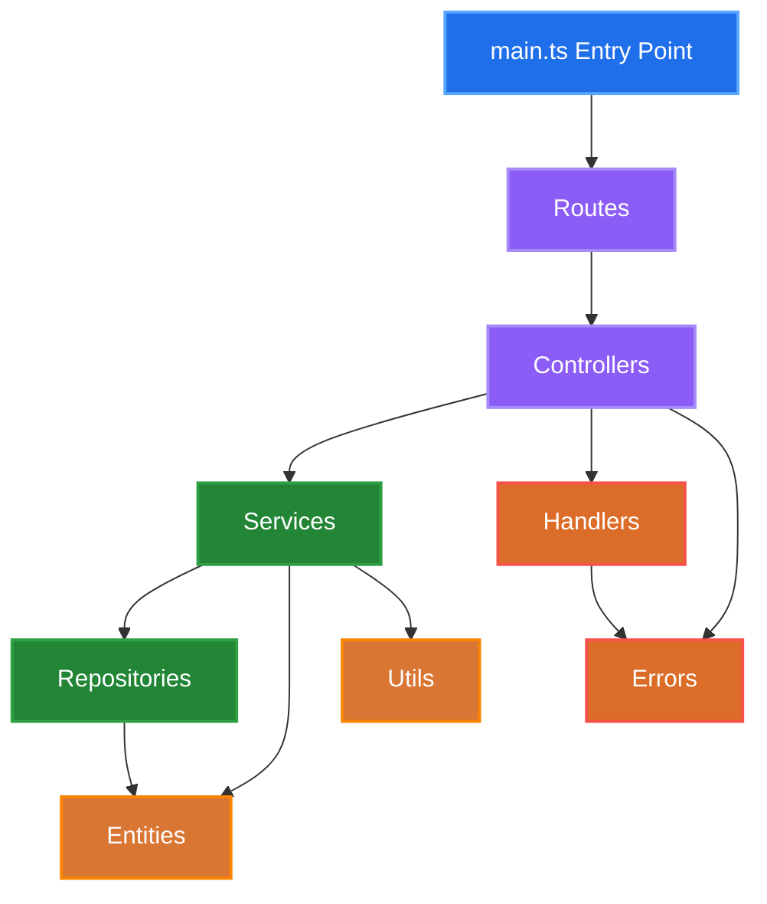

## Architecture

### Architecture Diagram



### Layer Responsibilities

| Layer            | Responsibility                                          |
| ---------------- | ------------------------------------------------------- |
| **Routes**       | Define API endpoints and route HTTP requests            |
| **Controllers**  | Handle HTTP requests, validate input, format responses  |
| **Services**     | Implement business logic and coordinate data operations |
| **Repositories** | Manage data access and persistence                      |
| **Entities**     | Define data models and structures                       |
| **Handlers**     | Process errors and exceptions                           |
| **Utils**        | Provide common utility functions                        |

### Request Flow

1. **Entry Point** (`main.ts`) - Initializes the server and loads routes
2. **Routes** - Direct incoming requests to appropriate controllers
3. **Controllers** - Process HTTP requests and coordinate with services
4. **Services** - Execute business logic and interact with repositories
5. **Repositories** - Handle data persistence and retrieval
6. **Response** - Data flows back through the layers to the client

## Project Structure

```
src/
├── main.ts # Application entry point and server setup
├── controllers/ # HTTP request handlers
│ └── _.controller.ts # Individual controller files
├── entities/ # Data models and type definitions
│ └── _.entity.ts # Individual entity files
├── errors/ # Custom error definitions
│ └── _.error.ts # Specific error types
├── handlers/ # Error and response handlers
│ ├── error.handler.ts # Global error handling
│ └── _.handler.ts # Other handlers
├── repositories/ # Data access layer
│ └── _.repository.ts # Individual repository files
├── routes/ # API route definitions
│ └── _.routes.ts # Individual route files
├── services/ # Business logic layer
│ └── _.service.ts # Individual service files
└── utils/ # Utility functions and helpers
├── index.ts # Utility exports
└── _.util.ts # Individual utility files

```

### File Naming Conventions

- Controllers: `*.controller.ts`
- Services: `*.service.ts`
- Repositories: `*.repository.ts`
- Routes: `*.routes.ts`
- Entities: `*.entity.ts`
- Errors: `*.error.ts`
- Utils: `*.util.ts`
