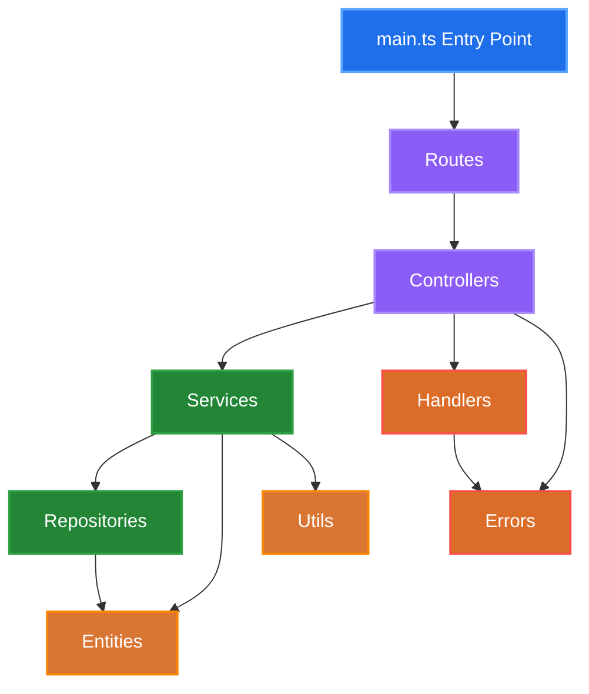

# About the project

A robust Node.js application built with TypeScript, following clean architecture principles and layered design patterns.

## Table of Contents

- [Overview](#overview)
- [Architecture](#architecture)
- [Getting Started](#getting-started)
- [Project Structure](#project-structure)
- [API Documentation](#api-documentation)
- [Development](#development)
- [Testing](#testing)
- [Deployment](#deployment)
- [Contributing](#contributing)

## Overview

This application implements a clean, maintainable architecture with clear separation of concerns across multiple layers. It's designed to be scalable, testable, and easy to maintain.

### Key Features

- **Clean Architecture**: Layered design with clear boundaries
- **TypeScript**: Full type safety and modern JavaScript features
- **Error Handling**: Comprehensive error management system
- **Modular Design**: Organized code structure for easy maintenance
- **Scalable**: Built to handle growth in features and complexity

## Architecture

### Architecture Diagram



### Layer Responsibilities

| Layer            | Responsibility                                          |
| ---------------- | ------------------------------------------------------- |
| **Routes**       | Define API endpoints and route HTTP requests            |
| **Controllers**  | Handle HTTP requests, validate input, format responses  |
| **Services**     | Implement business logic and coordinate data operations |
| **Repositories** | Manage data access and persistence                      |
| **Entities**     | Define data models and structures                       |
| **Handlers**     | Process errors and exceptions                           |
| **Utils**        | Provide common utility functions                        |

### Request Flow

1. **Entry Point** (`main.ts`) - Initializes the server and loads routes
2. **Routes** - Direct incoming requests to appropriate controllers
3. **Controllers** - Process HTTP requests and coordinate with services
4. **Services** - Execute business logic and interact with repositories
5. **Repositories** - Handle data persistence and retrieval
6. **Response** - Data flows back through the layers to the client

## Getting Started

### Prerequisites

- Node.js (version 16 or higher)
- npm or yarn
- TypeScript

### Installation

```bash
# Clone the repository
git clone https://github.com/gabrielmeiradev/desafio-ts-lidercap
cd desafio-ts-lidercap

# Install dependencies
npm install

# Install TypeScript globally (if not already installed)
npm install -g typescript
```

### Environment Setup

Create a `.env` file in the root directory:

```env
NODE_ENV=development
PORT=3000
ALLOWED_ORIGINS=http://localhost:3000
```

### Running the Application

```bash
# Development mode with hot reload
npm run dev

# Build for production
npm run build
```

### Best Practices

- Write tests for new features and bug fixes.
- Use mocks and fixtures to isolate test cases.
- Ensure high code coverage for critical modules.
- Run tests before every commit and pull request.

## Project Structure

```
src/
├── main.ts # Application entry point and server setup
├── controllers/ # HTTP request handlers
│ └── _.controller.ts # Individual controller files
├── entities/ # Data models and type definitions
│ └── _.entity.ts # Individual entity files
├── errors/ # Custom error definitions
│ └── _.error.ts # Specific error types
├── handlers/ # Error and response handlers
│ ├── error.handler.ts # Global error handling
│ └── _.handler.ts # Other handlers
├── repositories/ # Data access layer
│ └── _.repository.ts # Individual repository files
├── routes/ # API route definitions
│ └── _.routes.ts # Individual route files
├── services/ # Business logic layer
│ └── _.service.ts # Individual service files
└── utils/ # Utility functions and helpers
├── index.ts # Utility exports
└── _.util.ts # Individual utility files

```

### File Naming Conventions

- Controllers: `*.controller.ts`
- Services: `*.service.ts`
- Repositories: `*.repository.ts`
- Routes: `*.routes.ts`
- Entities: `*.entity.ts`
- Errors: `*.error.ts`
- Utils: `*.util.ts`

## API Documentation

### Base URL

```

http://localhost:3000/api

```

### Error Response Format

```json
{
  "statusCode": 400,
  "message": "User ID should be a number"
}
```

## Endpoints

### Users

- `GET /api/users/:userId` - Get user data
- `GET /api/users/:userId/full` - Get full user data, including posts and comments on the first post
- `GET /api/users/:userId/posts` - Get all posts for a user

### Posts

- `GET /api/posts/:postId/comments` - Get comments for a post

### Health Check

- `GET /health` - Get the health status of the server

## Development

### Code Style

This project uses:

- ESLint for code linting
- Prettier for code formatting

```bash
# Lint code
npm run lint
```

### Adding New Features

1. **Define Entity** - Create data models in `entities/`
2. **Create Repository** - Implement data access in `repositories/`
3. **Build Service** - Add business logic in `services/`
4. **Setup Controller** - Handle HTTP logic in `controllers/`
5. **Define Routes** - Add endpoints in `routes/`
6. **Add Error Handling** - Create custom errors if needed

### Development Workflow

```bash
# Create feature branch
git checkout -b feat/new-feature

# Make changes and commit
git add .
git commit -m "feat: add new feature"

# Run tests
npm test

# Push and create PR
git push origin feat/new-feature
```

## Testing

```bash
# Run all tests
npm test

# Run tests in watch mode
npm run test:watch

# Generate coverage report
npm run test:coverage
```

### Test Structure

```
tests/
├── controllers/  # Controllers tests
├── services/     # Services tests
```

## Deployment

### Production Build

```bash
# Build the application
npm run build

# The compiled JavaScript will be in the dist/ directory
```

### Environment Variables

Ensure these environment variables are set in production:

```env
NODE_ENV=production
PORT=3000

# Add other production-specific variables
```

## Contributing

### Development Setup

1. Fork the repository
2. Clone your fork
3. Install dependencies
4. Create a feature branch
5. Make your changes
6. Run tests and linting
7. Submit a pull request

### Commit Convention

This project follows conventional commits:

- `feat:` - New features
- `fix:` - Bug fixes
- `docs:` - Documentation changes
- `style:` - Code style changes
- `refactor:` - Code refactoring
- `test:` - Adding or updating tests
- `chore:` - Maintenance tasks

### Pull Request Guidelines

- Include a clear description of changes
- Add tests for new functionality
- Update documentation as needed
- Ensure all tests pass
- Follow the existing code style
